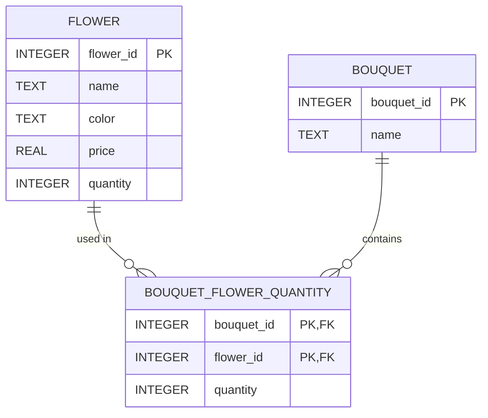

# Flower Shop Management System
## Business Objectives & Strategy Sections

## Introduction

Our team selected **Flower Shop Ordering To Go** from the capstone project list:

> *Create a flower shop application which deals in flower objects and use those flower objects in a bouquet object which can then be sold. Keep track of the number of objects and when you may need to order more.*

We built this as a command-line application in Python backed by a SQLite database. The shop stocks individual flowers, defines bouquet types as recipes of flowers, and sells bouquets by pulling the required flowers out of inventory. Employees and customers log into the same program but see different, role appropriate menus.

## Business Objectives

This application supports the day-to-day operations of a small flower shop with four objectives:

- **Track inventory** — Know what is in stock at all times, and make restocking a one-step operation.
- **Prevent overselling** — A bouquet can only be sold if every flower in its recipe is available, so inventory can never go negative or be left partially consumed by a failed sale.
- **Role-based access** — Employees and customers use the same program but see different capabilities appropriate to their role. Employees manage inventory, bouquet types, and customer accounts; customers browse and buy.
- **Manage accounts securely** — Employees can create, view, update, and remove customer accounts, and all accounts are protected by salted, hashed passwords.

## Strategy & Approach

We built the project in layers, from the database up, so each stage could be tested before the next depended on it:

1. **Database layer** — Design the schema and a reusable `DBbase` connection class, then implement `DatabaseService` with full CRUD for every table.
2. **Data population** — Write `initialize_database.py` to parse the two CSV data files and populate the database (20 flowers and 20 bouquet recipes).
3. **Object model** — Model `Flower`, `Bouquet`, and the `User` class hierarchy (`Employee` and `Customer` inherit from `User`), keeping business objects separate from database access.
4. **Interactive menu** — Build the menu in `main.py`, where the options shown are generated from the logged-in user's role.
5. **User management** — Add registration, login, and employee-managed customer accounts with salted password hashing.

## ERD

## Ethics & Critical Thinking

Because the application stores customer accounts, we treated data protection as a design requirement rather than an afterthought:

- **Password security** — Passwords are never stored or displayed in plain text. Each account gets a random 16-byte salt, and only the salted SHA-256 hash is stored. Password prompts use `getpass` so the password is not echoed to the screen.
- **Credential isolation** — No method in the service layer ever returns a password hash or salt to the rest of the program. A logged-in `User` object holds only public information (id, username, name), so credentials cannot leak through application code.
- **Least privilege** — Customers see only what they need: flower names and prices, bouquet recipes, and a buy option. Stock levels, internal IDs, other customers' information, and administrative actions are visible only to employees, and the menu rejects any command outside the user's role.
- **Data minimization** — We collect only the data the shop needs. Email is optional for customers, and employee accounts store no contact information at all.
- **Data integrity** — Selling a bouquet checks that every flower in the recipe is in stock *before* decrementing anything, so a failed sale can never leave inventory half-consumed. `CHECK` constraints in the schema make negative prices and negative stock impossible even if application code has a bug. Destructive actions (removing a customer, discontinuing a bouquet) require explicit confirmation.

We also thought critically about the limits of our design.

Our password protection works well for a course project. A real production system would go further: stronger security techniques, password rules, and a record of actions like account deletions.

One specific limitation we found ourselves: when an employee creates a customer account, the employee also sets the password. We know this is an area of improvement. Ideally, the customer would get a temporary password and be asked to reset it on their first login. A password reset feature was out of scope for this project.

We made similar scope decisions throughout. For example, we track inventory but left money and payment handling out. Our rule was simple: only build what we could fully finish and test in five weeks.

## Group Members Contribution

We collaborated through a shared GitHub repository, dividing ownership by module and integrating through commits and pull updates. All code follows the Black formatter for a consistent style across the team. `tests.py` exercises the database layer directly, and we tested the menu flows manually as each feature landed.

| Team member | Primary contributions |
|-------------|----------------------|
| Gaven | Database base class (`db_base.py`), schema design, database service layer and its CRUD functions|
| Anna | User class hierarchy and role logic (`user.py`), authentication flow |
| Gaby | Interactive menu and program flow (`main.py`), integration of the user layer |

In short, our critical thinking came down to three habits: knowing what is good enough for the situation, being honest about limitations, and testing our assumptions instead of trusting them.

