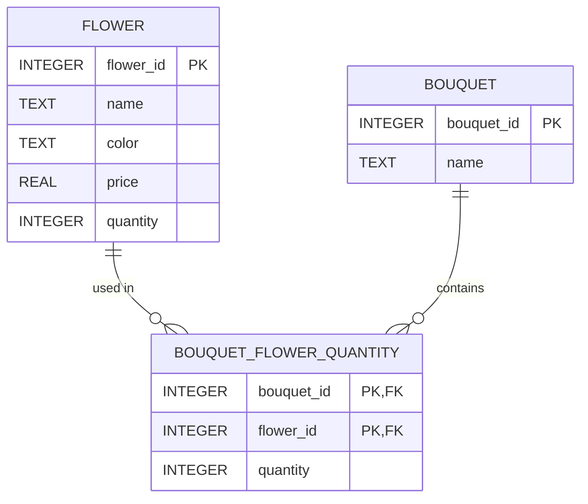

# IS 6495 Group Project

## Developer Setup
To keep our code changes clean and to avoid clutter in our commits/merges I suggest we all use the Black Formatter:

- [(VS Code)](https://marketplace.visualstudio.com/items?itemName=ms-python.black-formatter)
- [(Pycharm)](https://black.readthedocs.io/en/latest/integrations/editors.html#built-in-black-integration).  

It's intentionally very opinionated and does not allow customization.  It's sometime a little annoying, but it's much less annoying than navigating different code styles in a shared repository.  I think it's the best solution for this 5-week group project.

## ERD

